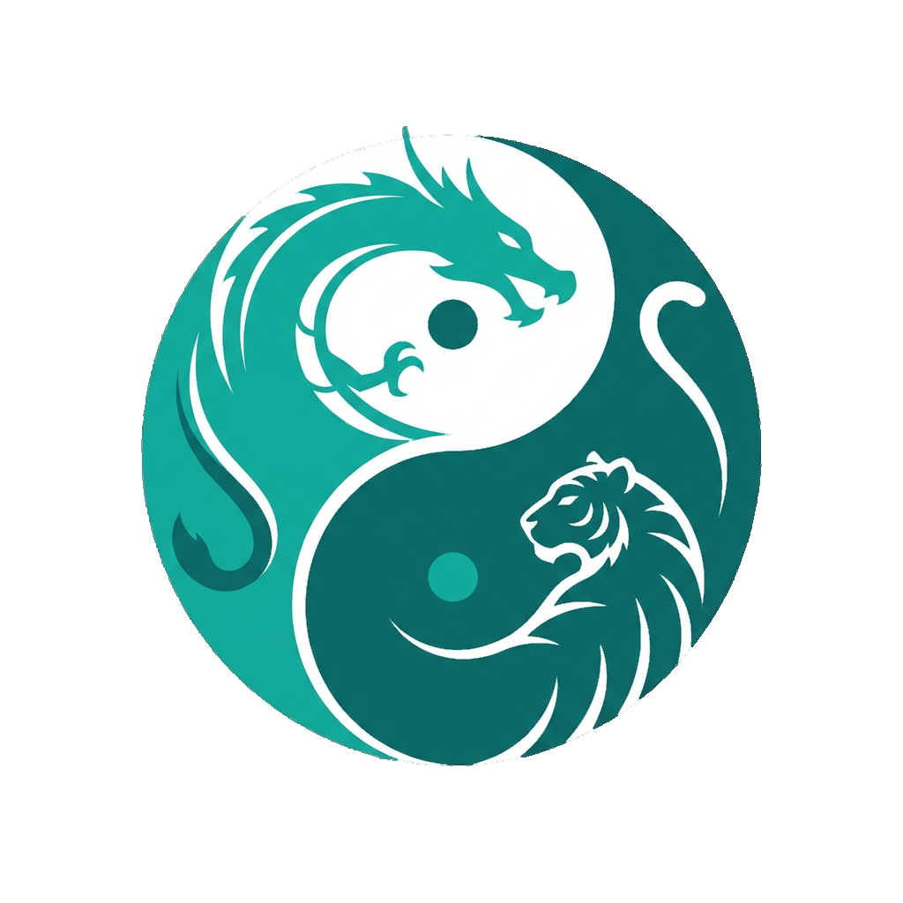

<p align="center">
  
</p>

<p align="center">
  
</p>

<h1 align="center">Lao Zi</h1>

<p align="center"><em>A Go plugin that keeps the LLM from deciding the parts that have to be right.</em></p>

---

**Dual-Constraint Insight Generation Engine (Go)**

[](https://github.com/Phoenix-Innovation/laozi/actions/workflows/test.yml)

Lao Zi is a domain-agnostic insight engine that constrains an LLM so its output is
deterministic where it matters. Numbers, severities, and citations are computed in
Go *before* the model is called; the LLM only writes the prose around them, and a
post-generation enforcement layer corrects (and logs) any deviation it produces.

> *"Constrained reasoning instead of rules."*

The LLM never decides whether a value is in range, never invents a threshold, and
cannot silently change a number or drop a citation — those are properties of the
engine, not hopes about the prompt.

---

## Repository layout & install

The Go module is at the repo root (`module github.com/Phoenix-Innovation/laozi`).
The demo command is in [`cmd/demo/`](cmd/demo/) and example apps in
[`Examples/`](Examples/); both build as part of the module.

```bash
go get github.com/Phoenix-Innovation/laozi
```

```go
import laozi "github.com/Phoenix-Innovation/laozi"
```

Requires Go 1.21+.

---

## Quick start

```go
package main

import (
    "context"
    "fmt"

    laozi "github.com/Phoenix-Innovation/laozi"
)

func main() {
    // The default client targets any OpenAI-compatible endpoint. Model/endpoint
    // default from config.go and can be overridden with options. The API key is
    // read from the LAOZI_API_KEY environment variable.
    engine := laozi.New(
        laozi.WithLLM(laozi.NewDefaultLLMClient(
            laozi.WithModel("gpt-4o"),
        )),
    )

    engine.AddCategory(laozi.Category{
        ID:   "revenue",
        Name: "Revenue Analysis",
        Thresholds: []laozi.Threshold{{
            Metric:    "monthly_revenue",
            Min:       100000,
            Max:       500000,
            Unit:      "USD",
            Source:    "Industry Benchmark",
            SourceURL: "https://example.com/benchmarks",
        }},
    })

    insights, err := engine.Analyze(context.Background(), map[string]float64{
        "monthly_revenue": 75000, // below min -> severity will be enforced to "warning"
    })
    if err != nil {
        panic(err)
    }
    for _, in := range insights {
        fmt.Println(in.Severity, in.Text, in.Reference)
        for _, v := range in.Violations { // audit trail of LLM mistakes the engine corrected
            fmt.Printf("  [%s] %q -> %q\n", v.Kind, v.LLMValue, v.Enforced)
        }
    }
}
```

---

## Core concepts

### Category

```go
laozi.Category{
    ID:          "liquidity",            // unique identifier
    Name:        "Liquidity Analysis",   // display name
    Thresholds:  []laozi.Threshold{...}, // metric constraints (Tier 1)
    Educational: false,                  // true -> generates an "info" / Did-You-Know tip
    RAGQuery:    "liquidity ratios",     // optional query for RAG context (Tier 2)
}
```

### Threshold

```go
laozi.Threshold{
    Metric:      "current_ratio",   // matches the input metrics map key
    Expression:  "",                // optional Laozi DSL (see below); host computes the value
    Min:         1.5,               // below -> warning
    Max:         3.0,               // above -> warning
    OptimalMin:  1.8,               // optional optimal band (informational)
    OptimalMax:  2.5,
    Unit:        "ratio",
    Source:      "CFA Institute",   // authority
    SourceURL:   "https://cfainstitute.org/...", // included/validated in the insight
    Description: "Current Assets / Current Liabilities",
}
```

### Severity

| Severity  | Meaning                                  |
|-----------|------------------------------------------|
| `warning` | value is OUTSIDE the threshold range     |
| `success` | value is WITHIN the threshold range      |
| `info`    | educational categories                   |

Severity is always computed by the engine from the threshold math.

---

## The enforcement layer

After the LLM responds, every insight is reconciled against the deterministic ground
truth. Each correction is recorded in `Insight.Violations` (the audit trail; an empty
slice means the model was fully compliant).

1. **Severity** — overwritten with the computed value. The LLM cannot change it.
2. **Citations** — the reference is rebuilt from the threshold `SourceURL`s **plus**
   any RAG sources retrieved for the call; a citation that matches none of them is
   replaced. The LLM cannot invent or drop a source.
3. **Suggested goals** — `target`/`unit`/`comparison` are snapped to a real threshold
   bound, or the goal is dropped if it names an unknown metric.
4. **Numbers in prose** — flagged when untraceable to the data or thresholds. In
   **strict mode** (`WithStrict(true)`) the narration is replaced entirely with a
   deterministic template, so no model-authored number can survive.

```go
engine := laozi.New(
    laozi.WithLLM(client),
    laozi.WithStrict(true), // replace prose on untraceable numbers
)
```

> Honest scope: the numeric-prose check is heuristic (free text legitimately contains
> numbers like "last 30 days"); severity, citation, and goal are the hard guarantees,
> and strict mode is the lever for prose.

### Retry & validation

Each insight is validated (placeholder strings rejected, reference required, minimum
text length). On failure the engine re-prompts the LLM with the validation error, up
to `MaxRetries` times. In strict mode an unparseable or exhausted response falls back
to a fully deterministic insight rather than erroring.

---

## Configuration

`config.go` is the single source of truth for build-time defaults; the `Config` struct
provides per-engine runtime overrides, and `DefaultLLMOption`/`RAGOption` helpers
override the client/RAG defaults.

```go
engine := laozi.New(
    laozi.WithLLM(client),
    laozi.WithConfig(laozi.Config{
        MaxRetries:  2,     // regeneration attempts on validation failure
        MaxParallel: 8,     // concurrent category analyses in Analyze
        MinTextLen:  20,    // minimum insight text length
        RAGTopK:     3,     // documents retrieved per RAG search
        AutoApprove: false, // skip the human draft/approval gate (see below)
        // Placeholders: []string{...}, // substrings that invalidate output
    }),
)
```

| Engine option            | Purpose                                             |
|--------------------------|-----------------------------------------------------|
| `WithLLM(LLMClient)`     | the LLM adapter (required)                          |
| `WithRAG(RAGStore)`      | optional Tier-2 retrieval                           |
| `WithStrict(bool)`       | replace prose on untraceable numbers                |
| `WithConfig(Config)`     | retries, parallelism, validation, auto-approve      |
| `WithContext(k, v)`      | domain context injected into prompts                |
| `WithReviewer(Reviewer)` | hook notified when a draft is created               |

Key `config.go` defaults: `LLMModel`, `LLMEndpoint`, `LLMTemperature`, `LLMMaxTokens`,
`LLMTopP`, `LLMTimeout`, `MaxParallelLLMCalls`, `RAGTopK`, `RAGEmbeddingDim`,
`RAGMinSimilarity`, `MaxRetries`, `MinInsightTextLen`, `RequireReference`,
`RequireApproval`, plus `InvalidPlaceholders`, `ValidSeverities`, and the prompt
templates.

---

## LLM client

Any type implementing `LLMClient` works:

```go
type LLMClient interface {
    Chat(ctx context.Context, systemPrompt, userPrompt string) (string, error)
}
```

The built-in `NewDefaultLLMClient` targets any OpenAI-compatible API and reads the key
from `LAOZI_API_KEY`:

```go
laozi.NewDefaultLLMClient(
    laozi.WithEndpoint("https://api.openai.com/v1/chat/completions"),
    laozi.WithModel("gpt-4o"),
    laozi.WithTemperature(0.3),
    laozi.WithMaxTokens(500),
    laozi.WithTopP(0.9),
)
```

```bash
export LAOZI_API_KEY="sk-..."
```

Works with OpenAI, Azure OpenAI, vLLM, Ollama, etc. by setting the endpoint/model.

---

## Optional RAG

```go
rag := laozi.NewInMemoryRAG(
    laozi.WithRAGTopK(3),
    laozi.WithRAGMinSimilarity(0.15),
    laozi.WithRAGEmbeddingDim(384),
)
rag.Add(laozi.RAGResult{
    Content:   "Healthy companies maintain a current ratio between 1.5 and 3.0...",
    Source:    "CFA Institute",
    SourceURL: "https://cfainstitute.org/...",
})

engine := laozi.New(laozi.WithLLM(client), laozi.WithRAG(rag))
```

For production, implement `RAGStore` over a real vector DB (Pinecone, Weaviate, etc.):

```go
type RAGStore interface {
    Search(ctx context.Context, query string, limit int) ([]RAGResult, error)
}
type RAGResult struct {
    Content, Source, SourceURL string
    Score                      float64
}
```

> The built-in `InMemoryRAG` uses a lexical bag-of-words embedding (good for
> dev/testing), which is why `RAGMinSimilarity` defaults low (0.15). For semantic
> retrieval, plug a real embedding model in behind `RAGStore` and raise the threshold.

---

## Context

```go
engine := laozi.New(
    laozi.WithLLM(client),
    laozi.WithContext("company", map[string]any{"name": "TechCorp", "stage": "Growth"}),
    laozi.WithContext("period", "Q4 2025"),
)
engine.SetContext("user", map[string]any{"role": "CFO"}) // goroutine-safe
```

---

## Lao Zi Expression Language (DSL)

A threshold may carry an `Expression` written in the Lao Zi DSL — a small, deterministic
language that **parses, validates, and compiles to SQL**. The engine itself does not
execute SQL: the host runs the compiled query against its datastore and feeds the
numeric result back as the metric value, preserving "the LLM narrates, never calculates."

```go
laozi.Threshold{
    Metric:     "monthly_revenue",
    Expression: `SUM(amount) WHERE(type = 'revenue') OVER(30 days)`,
    Min:        10000, Max: 50000, Unit: "USD",
    Source: "Benchmark", SourceURL: "https://bench/x",
}
```

### Built-in test parser

`CheckDSL` (also `engine.CheckExpression`) is the test parser host apps call to flag
syntax or semantic errors live as a user edits an expression:

```go
errs := engine.CheckExpression(`SUM(amount`)        // -> [col 9: expected ')']
errs  = engine.CheckExpression(`GINI(amount)`)       // -> [GINI requires GROUP_BY(field)]
sql, _ := laozi.CompileSQL(`COUNT(*) WHERE(type = 'CREDIT') PERIOD(YTD)`)
// also: laozi.ParseDSL(expr) (Expr, error)
```

### Functions

| Category    | Functions |
|-------------|-----------|
| Aggregation | `SUM` `AVG` `COUNT(*)` `MIN` `MAX` |
| Math        | `ROUND(x,n)` `ABS` `NULLIF(a,b)` `SQRT` |
| Statistical | `GINI(x GROUP_BY(k))` `STDEV` `CHANGE(x, n unit)` `BENFORD` |
| Time/Period | `OVER(n unit)` `PERIOD(name)` `ON(pattern)` |
| Filter      | `WHERE(cond)` `AND` `OR` `GROUP_BY(field)` |

Operators follow PEMDAS (`^` right-associative). Named periods: `YTD`, `MTD`, `QTD`,
`last_year`, `last_quarter`, `last_month`.

> Compile conventions: time windows/periods filter a conventional `event_time` column,
> and the forensic functions (`GINI`, `BENFORD`, `CHANGE`) compile to lowercase SQL UDFs
> the host must provide. A `WHERE`/window on an aggregate compiles to conditional
> aggregation, so composed arithmetic stays scalar.

---

## Human validation loop

Because Lao Zi is a plugin (it cannot render UI), a category created with DSL is not
registered immediately. `ProposeCategory` validates every expression and returns a
**Draft** — JSON-serializable, carrying each expression's compiled SQL and validation
result for the host app to render. The category is promoted to production only when the
app calls `ApproveDraft`.

```go
draft, err := engine.ProposeCategory(cat) // invalid DSL -> err, no draft
// surface draft (and draft.Expressions) in your UI for human review...

engine.ApproveDraft(draft.ID)          // registers the category; Analyze will use it
engine.RejectDraft(draft.ID, "reason") // never promoted

engine.PendingDrafts()  // []*Draft awaiting approval
engine.Draft(id)        // (*Draft, bool)
```

Optional push notification when a draft is created:

```go
type Reviewer interface{ OnDraft(d *Draft) }
engine := laozi.New(laozi.WithLLM(client), laozi.WithReviewer(myReviewer))
```

The gate is on by default (`RequireApproval`); set `Config{AutoApprove: true}` to
register proposals immediately (e.g. for trusted/automated pipelines).

---

## Adaptive query classification (input side)

Free-form user input is classified into one **domain** before any context is
loaded, so analysis is limited to what that domain needs. Domains are fungible
(they differ per market), so they're pluggable — in code or from a config file.

The cascade has three layers with progressive fallback:

1. **LLM classifier** — a low-temperature call returns one domain word; if it's a
   specific domain (not the fallback), classification is done.
2. **Keyword regex** — a deterministic safety net when the LLM is unsure.
3. **Default** — the fallback domain (`general`).

The LLM is optional: with no LLM client the classifier runs layers 2–3 only,
which is fully deterministic.

### Code-level domains (phase 1)

```go
clf := laozi.NewClassifier(
    laozi.WithClassifierLLM(lowTempClient), // optional; omit for keyword-only
    laozi.WithDomains([]laozi.Domain{
        {
            Name:        "financial_analysis",
            Description: "expenses, revenue, cash flow, margins",
            Keywords:    []string{"expense", "revenue", "cash flow", "margin"},
            Categories:  []string{"liquidity", "profitability"}, // context to limit to
        },
        {
            Name:        "transaction_clarification",
            Description: "payments and transfers to payees",
            Keywords:    []string{"payment", "transfer", "venmo", "vendor"},
            Categories:  []string{"transactions"},
        },
    }),
)

cls := clf.Classify(ctx, "our operating margin slipped this quarter", history)
// cls.Domain == "financial_analysis", cls.Layer == 1|2

// Limit analysis to the classified domain's categories:
d, _ := clf.Domain(cls.Domain)
insights, _ := engine.AnalyzeSelected(ctx, d.Categories, metrics)
```

### Config file (documented YAML subset)

```go
spec, err := laozi.LoadDomainsFile("domains.yaml")
clf := laozi.NewClassifier(laozi.WithSpec(spec), laozi.WithClassifierLLM(client))
```

```yaml
# domains.yaml  (see domains.example.yaml)
fallback: general
domains:
  - name: financial_analysis
    description: Expenses, revenue, cash flow, margins
    keywords: [expense, revenue, "cash flow", profit, margin]
    categories: [liquidity, profitability]
    actions: [confirm, reclassify]
    max_tokens: 800
```

> The loader (`LoadDomains`/`LoadDomainsFile`) parses an intentionally small,
> documented YAML subset with no third-party dependency: top-level `fallback:`
> and `domains:`, list items beginning `- name:`, scalar fields, and inline
> `[a, b, "c d"]` lists; `#` and blank lines are skipped, inline trailing
> comments are not supported. For arbitrary YAML, unmarshal into `[]laozi.Domain`
> with your own library — the struct carries both `json` and `yaml` tags.

### Spec

A `Domain` is: `Name` (the resolved category word), `Description` (shown to the
LLM classifier), `Keywords` (layer-2 matchers), `Categories` (IDs to limit
analysis to), and optional `SystemPrompt`, `Actions`, and `MaxTokens` for a
domain-tuned pipeline. `Classify` returns `{Domain, Layer, Reason}`. The LLM
classifier sees the last `ClassifierHistoryWindow` (config default 4) conversation
lines.

---

## Durable audit

Lao Zi computes the auditable facts — the enforced severity/citation/number
corrections (`Insight.Violations`) and the human draft decisions — but it does
**not** pick a datastore. Persistence is implementation-dependent: a host plugs
an `AuditSink` over Postgres, an append-only log, an object store, Kafka, a WORM
bucket, etc. (the same pattern as `RAGStore`).

```go
type AuditSink interface {
    Record(ctx context.Context, e AuditEvent) error // MUST be concurrency-safe
}

engine := laozi.New(laozi.WithLLM(client), laozi.WithAuditSink(mySink))
```

An `AuditEvent` is one record, discriminated by `Kind`:

- `analysis` — an enforced insight (carries the `Insight`, including `Violations`, plus the metrics and strict flag). Emitted for every category from `Analyze`/`AnalyzeCategory`/`AnalyzeSelected`.
- `draft_proposed` / `draft_approved` / `draft_rejected` — the human validation loop, each with **`Actor` (who)** and **`Time` (when)**. The `Draft` itself also records `CreatedBy`/`CreatedAt` and `DecidedBy`/`DecidedAt`.

The draft methods take the actor explicitly:

```go
d, _ := engine.ProposeCategory(cat, "alice")   // who proposed
engine.ApproveDraft(d.ID, "bob")               // who approved (registers the category)
engine.RejectDraft(d.ID, "carol", "reason")    // who rejected
```

A reference sink, `MemoryAuditSink`, ships in the box: an in-process,
append-only, **hash-chained** log (each entry's hash covers the prior entry, so
any later edit breaks the chain — `Verify()` detects it). It is not durable
across restarts; it demonstrates the seam, powers the demo's audit panel, and
its chaining can be reused by a real durable sink for tamper-evidence.

> Audit emit is fire-and-forget: a transient sink error does not fail an insight
> or an approval. Hosts needing audit-before-ack implement that inside `Record`
> (durable write, retry, dead-letter). The `Draft` and returned `Insight` still
> carry the record in-process regardless.

---

## Output structures

```go
type Insight struct {
    ID             string
    CategoryID     string
    CategoryName   string
    Text           string
    Severity       Severity        // warning | success | info (engine-determined)
    RelatedMetrics []string
    Reference      string          // enforced from thresholds + RAG sources
    SuggestedGoal  *SuggestedGoal
    Violations     []Violation     // audit trail: what the LLM tried vs. what was enforced
    Metadata       map[string]string
}

type Violation struct {
    Kind, LLMValue, Enforced, Detail string // kind: severity|reference|goal|number|parse
}

type Draft struct {
    ID, Kind     string
    Status       Status // draft | approved | rejected
    Category     *Category
    Expressions  []ExpressionReview // per-expression: SQL, Valid, Errors
    RejectReason string
}
```

---

## Concurrency

The engine is safe for concurrent use. `Analyze` runs categories in parallel bounded by
`Config.MaxParallel`, and `SetContext` may be called while analysis is in flight; shared
state is guarded by a `sync.RWMutex`. The suite includes a `-race` parallel stress test.

---

## Demo app

A self-contained web app exercises every core feature. It runs offline (a
deliberately-misbehaving demo model stands in for a real LLM so you can watch
the enforcement layer correct it):

```bash
go run ./cmd/demo      # then open http://localhost:8080
```

The single page covers: **Analyze + enforcement** (severity/citation/number
corrections with the Violations audit trail, plus a strict-mode toggle that
replaces invented numbers), **adaptive classification** (free-form input → domain
→ context-limited analysis), the **DSL test parser** (validate an expression, see
compiled SQL or errors), and the **human draft/approval loop** (propose a
category with a DSL expression → review the draft + compiled SQL → approve). For
a real model, swap `demoLLM` for `laozi.NewDefaultLLMClient()` and set
`LAOZI_API_KEY`.

---

## Testing

```bash
go build ./...
go vet ./...
go test -race ./...    # full suite under the race detector
```

The suite (39 test functions, plus subtables) covers:

- **DSL** — `TestDSLAllFunctions` is a per-function conformance table (every function,
  keyword, named period, and unit, with a coverage guard against the function registry),
  plus valid/error/compile suites.
- **Enforcement** — a 14-row truth table (severity override, citation replacement, goal
  alignment, strict-mode prose replacement, parse fallback).
- **Batch & concurrency** — all-categories `Analyze`, per-category enforcement, and a
  `-race` parallel stress test.
- **Draft/approval** — propose-creates-draft-not-registered, approve-promotes,
  reject-never-promotes, invalid-DSL-blocked, reviewer hook, auto-approve, JSON round-trip.
- **Classification** — the three-layer cascade (LLM hit, regex fallback, default,
  LLM-error degradation, no-LLM determinism), the YAML-subset loader (parse +
  error cases), and `AnalyzeSelected` context-limiting.
- **Retry/regeneration**, **RAG**, and a runnable doc `Example`.

---

## License

MIT License — © 2026 Pi.Tech
